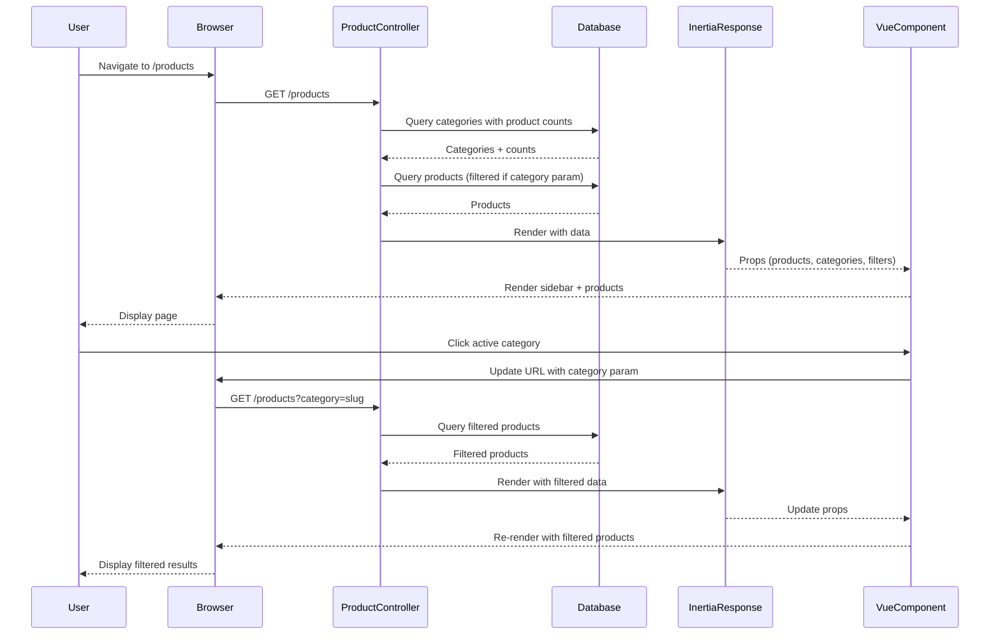

# Design Document: Corteiz-Style Sidebar

## Overview

This design implements a Corteiz-inspired sidebar navigation system for the products page. The sidebar provides category filtering, social media links, and shipping policy information with a distinctive black-and-green aesthetic using OCR A font. The implementation leverages Laravel Inertia.js with Vue 3 for seamless client-side interactions and Filament v3 for admin panel category management.

The sidebar displays categories dynamically fetched from the database, with visual differentiation between active categories (with products) and inactive categories (without products). Active categories enable product filtering, while inactive categories appear with strikethrough styling to indicate unavailability.

## Architecture

### System Components

The system consists of four primary layers:

1. **Backend Layer (Laravel)**
   - ProductController: Enhanced to fetch categories with product counts
   - Category Model: Extended with display_order field
   - Database: Categories table with display_order column

2. **Admin Layer (Filament v3)**
   - CategoryResource: Enhanced with display_order field management
   - Drag-and-drop reordering interface (optional enhancement)

3. **Frontend Layer (Vue 3 + Inertia.js)**
   - Sidebar Component: Main navigation component
   - ShippingPolicyModal Component: Modal for shipping information
   - CategoryList Component: Renders category items with active/inactive states
   - Products/Index Page: Enhanced with sidebar integration

4. **State Management**
   - URL query parameters for category filtering
   - Inertia.js shared data for categories
   - Local component state for modal visibility and mobile menu

### Data Flow



### Component Hierarchy

```
AppLayout
└── Products/Index.vue
    ├── Sidebar.vue
    │   ├── Logo (clickable)
    │   ├── CategoryList.vue
    │   │   └── CategoryItem.vue (multiple)
    │   │       ├── Active (white, clickable, hover green)
    │   │       └── Inactive (gray, strikethrough, not clickable)
    │   ├── InstagramLink
    │   └── ShippingPolicyLink
    ├── ShippingPolicyModal.vue
    │   ├── Modal backdrop
    │   ├── Modal content
    │   └── Close button
    └── ProductGrid
        └── ProductCard (multiple)
```

## Components and Interfaces

### Backend Components

#### 1. Database Migration: Add display_order to categories

**File**: `database/migrations/YYYY_MM_DD_HHMMSS_add_display_order_to_categories_table.php`

```php
public function up(): void
{
    Schema::table('categories', function (Blueprint $table) {
        $table->integer('display_order')->default(0)->after('slug');
    });
}
```

**Purpose**: Enables administrators to control the order in which categories appear in the sidebar.

#### 2. Category Model Enhancement

**File**: `app/Models/Category.php`

**Changes**:
- Add `display_order` to `$fillable` array
- Add scope for ordered categories
- Add method to count active products

```php
protected $fillable = [
    'name',
    'slug',
    'display_order',
];

public function scopeOrdered($query)
{
    return $query->orderBy('display_order', 'asc')
                 ->orderBy('name', 'asc');
}

public function activeProductsCount()
{
    return $this->products()->where('status', 'active')->count();
}
```

#### 3. ProductController Enhancement

**File**: `app/Http/Controllers/ProductController.php`

**Changes to `index()` method**:

```php
public function index(Request $request)
{
    // Existing product query logic...
    
    // Enhanced category fetching with caching
    $categories = Cache::remember('sidebar_categories', 300, function () {
        return Category::ordered()
            ->withCount(['products' => function ($query) {
                $query->where('status', 'active');
            }])
            ->get()
            ->map(function ($category) {
                return [
                    'id' => $category->id,
                    'name' => $category->name,
                    'slug' => $category->slug,
                    'products_count' => $category->products_count,
                    'is_active' => $category->products_count > 0,
                ];
            });
    });

    // Add selected category info if filtering
    $selectedCategory = null;
    if ($request->filled('category')) {
        $selectedCategory = Category::where('slug', $request->category)->first();
    }

    return Inertia::render('Products/Index', [
        'products' => $products,
        'categories' => $categories,
        'selectedCategory' => $selectedCategory,
        'filters' => [
            'category' => $request->category,
            // ... other filters
        ],
    ]);
}
```

**Key Design Decisions**:
- Cache categories for 5 minutes to reduce database load
- Pre-calculate `is_active` flag on backend to simplify frontend logic
- Return selected category object for display in header

#### 4. Filament CategoryResource Enhancement

**File**: `app/Filament/Resources/CategoryResource.php`

**Changes to `form()` method**:

```php
public static function form(Form $form): Form
{
    return $form
        ->schema([
            Forms\Components\TextInput::make('name')
                ->required()
                ->maxLength(100)
                ->live(onBlur: true)
                ->afterStateUpdated(fn (string $operation, $state, Forms\Set $set) => 
                    $operation === 'create' ? $set('slug', \Illuminate\Support\Str::slug($state)) : null
                ),
            Forms\Components\TextInput::make('slug')
                ->required()
                ->maxLength(120)
                ->unique(ignoreRecord: true),
            Forms\Components\TextInput::make('display_order')
                ->numeric()
                ->default(0)
                ->helperText('Lower numbers appear first. Categories with the same order are sorted alphabetically.')
                ->required(),
        ]);
}
```

**Changes to `table()` method**:

```php
public static function table(Table $table): Table
{
    return $table
        ->columns([
            Tables\Columns\TextColumn::make('display_order')
                ->label('Order')
                ->sortable(),
            Tables\Columns\TextColumn::make('name')
                ->searchable()
                ->sortable(),
            Tables\Columns\TextColumn::make('slug')
                ->searchable()
                ->sortable()
                ->copyable(),
            Tables\Columns\TextColumn::make('products_count')
                ->counts('products')
                ->label('Products')
                ->sortable(),
            Tables\Columns\TextColumn::make('created_at')
                ->dateTime()
                ->sortable()
                ->toggleable(isToggledHiddenByDefault: true),
        ])
        ->defaultSort('display_order', 'asc');
}
```

### Frontend Components

#### 1. Sidebar Component

**File**: `resources/js/Components/Sidebar.vue`

**Props**:
- `categories`: Array of category objects
- `selectedCategorySlug`: String (current filter)
- `isOpen`: Boolean (for mobile)

**Emits**:
- `close`: When mobile sidebar should close

**Template Structure**:
```vue
<template>
  <aside class="sidebar" :class="{ 'mobile-open': isOpen }">
    <!-- Logo -->
    <Link href="/" class="logo-container">
      
    </Link>
    
    <!-- Categories -->
    <CategoryList 
      :categories="categories" 
      :selected-slug="selectedCategorySlug"
      @category-click="handleCategoryClick"
    />
    
    <!-- Instagram Link -->
    <a 
      href="https://instagram.com/marketttmarkettt" 
      target="_blank"
      class="social-link"
    >
      <InstagramIcon />
    </a>
    
    <!-- Shipping Policy Link -->
    <button 
      @click="showShippingModal = true"
      class="shipping-link"
    >
      SHIPPING POLICY
    </button>
    
    <!-- Mobile Close Button -->
    <button 
      v-if="isOpen" 
      @click="$emit('close')"
      class="close-button"
    >
      ×
    </button>
  </aside>
  
  <!-- Shipping Policy Modal -->
  <ShippingPolicyModal 
    :show="showShippingModal"
    @close="showShippingModal = false"
  />
</template>
```

**Styling** (Tailwind classes):
- Background: `bg-black`
- Width: `w-60` (240px)
- Position: `fixed left-0 top-0 h-screen`
- Font: Custom OCR A font
- Mobile: Hidden by default on `lg:block`, overlay with `fixed inset-0 z-50` when open

#### 2. CategoryList Component

**File**: `resources/js/Components/CategoryList.vue`

**Props**:
- `categories`: Array
- `selectedSlug`: String

**Emits**:
- `category-click`: When active category is clicked

**Template Structure**:
```vue
<template>
  <nav class="category-list">
    <div
      v-for="category in categories"
      :key="category.id"
      class="category-item"
      :class="{
        'active': category.is_active,
        'inactive': !category.is_active,
        'selected': selectedSlug === category.slug
      }"
    >
      <Link
        v-if="category.is_active"
        :href="`/products?category=${category.slug}`"
        class="category-link"
      >
        {{ category.name }}
      </Link>
      <span v-else class="category-inactive">
        {{ category.name }}
      </span>
    </div>
  </nav>
</template>
```

**Styling**:
- Active categories: `text-white hover:text-[#CCFF00] hover:bg-[#CCFF00]/10 cursor-pointer`
- Selected category: `bg-[#CCFF00] text-black`
- Inactive categories: `text-[#666666] line-through cursor-default`

#### 3. ShippingPolicyModal Component

**File**: `resources/js/Components/ShippingPolicyModal.vue`

**Props**:
- `show`: Boolean

**Emits**:
- `close`: When modal should close

**Template Structure**:
```vue
<template>
  <Teleport to="body">
    <Transition name="modal">
      <div v-if="show" class="modal-backdrop" @click="$emit('close')">
        <div class="modal-content" @click.stop>
          <h2 class="modal-title">SHIPPING POLICY</h2>
          
          <div class="modal-body">
            <p>WE ONLY SHIP WITHIN INDONESIA</p>
            <p>ALL ORDERS ARE PROCESSED AND SHIPPED WITHIN 5–10 WORKING DAYS</p>
            <p>UNLESS A PRE-ORDER SHIP DATE IS SPECIFIED</p>
            <p>WE DO NOT ACCEPT ORDERS FROM OUTSIDE INDONESIA</p>
            <p>PAYMENTS CANNOT BE COMPLETED BY CUSTOMERS LOCATED OUTSIDE INDONESIA</p>
            <p>ANY ORDERS IDENTIFIED AS BEING FROM OUTSIDE INDONESIA WILL BE AUTOMATICALLY CANCELLED AND NOT PROCESSED</p>
            <p>SHIPPING WILL NOT BE PROCESSED FOR ANY DESTINATIONS OUTSIDE INDONESIA</p>
            <p>IF AN INVALID ORDER IS PLACED FROM OUTSIDE INDONESIA, ANY ASSOCIATED COSTS OR FEES WILL BE THE RESPONSIBILITY OF THE CUSTOMER</p>
            <p>PLEASE REFER TO OUR TERMS OF SALE FOR FURTHER INFORMATION</p>
          </div>
          
          <button @click="$emit('close')" class="close-btn">
            CLOSE
          </button>
        </div>
      </div>
    </Transition>
  </Teleport>
</template>
```

**Styling**:
- Backdrop: `fixed inset-0 bg-black/80 z-50`
- Content: `bg-black border-2 border-white max-w-2xl mx-auto mt-20 p-8`
- Text: `text-white font-['OCR_A'] uppercase`
- Close button: `bg-[#CCFF00] text-black hover:bg-[#CCFF00]/80`

**Keyboard Support**:
```js
onMounted(() => {
  document.addEventListener('keydown', handleEscape);
});

onUnmounted(() => {
  document.removeEventListener('keydown', handleEscape);
});

const handleEscape = (e) => {
  if (e.key === 'Escape' && props.show) {
    emit('close');
  }
};
```

#### 4. Products/Index.vue Enhancement

**File**: `resources/js/Pages/Products/Index.vue`

**Changes**:
- Import and include Sidebar component
- Add mobile menu state
- Add hamburger button for mobile
- Display selected category in header
- Add "Clear Filter" button when category is selected

```vue
<script setup>
import { ref } from 'vue';
import { router } from '@inertiajs/vue3';
import AppLayout from '@/Layouts/AppLayout.vue';
import ProductCard from '@/Components/ProductCard.vue';
import Sidebar from '@/Components/Sidebar.vue';

const props = defineProps({
    products: Object,
    categories: Array,
    selectedCategory: Object,
    filters: Object,
});

const mobileMenuOpen = ref(false);

const clearFilter = () => {
    router.get('/products');
};
</script>

<template>
    <AppLayout>
        <div class="min-h-screen bg-black flex">
            <!-- Sidebar - Desktop -->
            <Sidebar 
                :categories="categories"
                :selected-category-slug="filters.category"
                :is-open="mobileMenuOpen"
                @close="mobileMenuOpen = false"
                class="hidden lg:block"
            />
            
            <!-- Mobile Menu Button -->
            <button 
                @click="mobileMenuOpen = true"
                class="lg:hidden fixed top-4 left-4 z-40 p-2 bg-black border border-white"
            >
                <svg class="w-6 h-6 text-white" fill="none" stroke="currentColor" viewBox="0 0 24 24">
                    <path stroke-linecap="round" stroke-linejoin="round" stroke-width="2" d="M4 6h16M4 12h16M4 18h16" />
                </svg>
            </button>
            
            <!-- Mobile Sidebar Overlay -->
            <Sidebar 
                v-if="mobileMenuOpen"
                :categories="categories"
                :selected-category-slug="filters.category"
                :is-open="mobileMenuOpen"
                @close="mobileMenuOpen = false"
                class="lg:hidden"
            />
            
            <!-- Main Content -->
            <div class="flex-1 lg:ml-60">
                <!-- Header -->
                <div class="border-b border-[#1a1a1a]">
                    <div class="max-w-7xl mx-auto px-4 sm:px-6 lg:px-8 py-8">
                        <h1 class="text-4xl md:text-5xl font-['OCR_A'] uppercase tracking-tight mb-2">
                            {{ selectedCategory ? selectedCategory.name : 'MARKETTTMARKETTT' }}
                        </h1>
                        <div class="flex items-center justify-between">
                            <p class="text-sm text-[#999999] uppercase tracking-wide">
                                {{ products.total }} PRODUCTS
                            </p>
                            <button 
                                v-if="selectedCategory"
                                @click="clearFilter"
                                class="text-sm text-[#CCFF00] hover:text-white uppercase tracking-wide"
                            >
                                CLEAR FILTER
                            </button>
                        </div>
                    </div>
                </div>

                <div class="max-w-7xl mx-auto px-4 sm:px-6 lg:px-8 py-8">
                    <!-- Products Grid (existing code) -->
                </div>
            </div>
        </div>
    </AppLayout>
</template>
```

## Data Models

### Category Model

**Table**: `categories`

**Schema**:
```
id: bigint (primary key)
name: varchar(100)
slug: varchar(120) unique
display_order: integer default 0
created_at: timestamp
updated_at: timestamp
```

**Relationships**:
- `hasMany(Product::class)`: One category has many products

**Scopes**:
- `ordered()`: Orders by display_order ASC, then name ASC

**Methods**:
- `activeProductsCount()`: Returns count of active products

### Category API Response Format

When categories are passed to the frontend:

```json
[
  {
    "id": 1,
    "name": "T-SHIRTS",
    "slug": "t-shirts",
    "products_count": 15,
    "is_active": true
  },
  {
    "id": 2,
    "name": "HOODIES",
    "slug": "hoodies",
    "products_count": 0,
    "is_active": false
  }
]
```

## Error Handling

### Backend Error Scenarios

1. **Invalid Category Slug in Query Parameter**
   - **Scenario**: User navigates to `/products?category=invalid-slug`
   - **Handling**: Controller ignores invalid category, displays all products
   - **User Experience**: No error message, graceful fallback

2. **Database Query Failure**
   - **Scenario**: Database connection lost during category fetch
   - **Handling**: Laravel exception handler catches, logs error
   - **User Experience**: Display error page with retry option

3. **Cache Failure**
   - **Scenario**: Redis/cache driver unavailable
   - **Handling**: Fallback to direct database query
   - **User Experience**: Slightly slower load time, no visible error

### Frontend Error Scenarios

1. **Missing Categories Data**
   - **Scenario**: Backend fails to pass categories prop
   - **Handling**: Component checks for empty/null categories, renders empty sidebar
   - **User Experience**: Sidebar visible but no categories shown

2. **Navigation Failure**
   - **Scenario**: Inertia.js navigation fails
   - **Handling**: Fallback to full page reload
   - **User Experience**: Brief loading state, page refreshes

3. **Modal Rendering Issues**
   - **Scenario**: Teleport target not available
   - **Handling**: Modal renders inline as fallback
   - **User Experience**: Modal still functional, slightly different positioning

## Testing Strategy

This feature is primarily UI-focused with simple CRUD and filtering operations. Property-based testing is not applicable here as there are no universal properties, parsers, or complex algorithms to test. Instead, we'll use a combination of unit tests, component tests, and integration tests.

### Unit Tests (PHPUnit)

**Backend Tests**:

1. **Category Model Tests** (`tests/Unit/Models/CategoryTest.php`)
   - Test `ordered()` scope returns categories sorted by display_order then name
   - Test `activeProductsCount()` returns correct count
   - Test `activeProductsCount()` excludes inactive products

2. **ProductController Tests** (`tests/Unit/Controllers/ProductControllerTest.php`)
   - Test category filtering applies correct where clause
   - Test invalid category slug is ignored gracefully
   - Test categories are cached with correct TTL

### Component Tests (Vitest + Vue Test Utils)

**Frontend Tests**:

1. **Sidebar Component Tests** (`resources/js/Components/__tests__/Sidebar.spec.js`)
   - Test sidebar renders with provided categories
   - Test logo links to home page
   - Test Instagram link opens in new tab with correct URL
   - Test shipping policy button opens modal
   - Test mobile close button emits close event

2. **CategoryList Component Tests** (`resources/js/Components/__tests__/CategoryList.spec.js`)
   - Test active categories render as clickable links
   - Test inactive categories render with strikethrough
   - Test inactive categories are not clickable
   - Test selected category has correct styling
   - Test category links have correct href format

3. **ShippingPolicyModal Component Tests** (`resources/js/Components/__tests__/ShippingPolicyModal.spec.js`)
   - Test modal renders when show prop is true
   - Test modal hidden when show prop is false
   - Test close button emits close event
   - Test backdrop click emits close event
   - Test Escape key emits close event
   - Test modal content displays all required text

### Integration Tests (Laravel Dusk or Pest)

1. **Category Filtering Flow** (`tests/Feature/CategoryFilteringTest.php`)
   - Test clicking active category filters products
   - Test URL updates with category query parameter
   - Test clear filter button removes category parameter
   - Test pagination maintains category filter
   - Test filtered products all belong to selected category

2. **Admin Category Management** (`tests/Feature/Admin/CategoryManagementTest.php`)
   - Test admin can create category with display_order
   - Test admin can update display_order
   - Test categories display in correct order in admin panel
   - Test product count updates when products added/removed

3. **Mobile Sidebar Behavior** (`tests/Feature/MobileSidebarTest.php`)
   - Test hamburger button visible on mobile viewport
   - Test sidebar hidden by default on mobile
   - Test clicking hamburger opens sidebar overlay
   - Test clicking backdrop closes sidebar
   - Test sidebar visible by default on desktop viewport

### Manual Testing Checklist

- [ ] Sidebar displays on desktop (>1024px width)
- [ ] Sidebar hidden on mobile (<1024px width)
- [ ] Hamburger menu works on mobile
- [ ] Active categories clickable with hover effect
- [ ] Inactive categories show strikethrough and not clickable
- [ ] Selected category highlighted with green background
- [ ] Instagram link opens correct profile in new tab
- [ ] Shipping policy modal opens and displays all text
- [ ] Modal closes on backdrop click, close button, and Escape key
- [ ] Category filtering works correctly
- [ ] Clear filter button appears and works
- [ ] Pagination maintains category filter
- [ ] Admin panel allows setting display_order
- [ ] Categories display in correct order on frontend
- [ ] Cache invalidation works when categories updated

### Performance Testing

1. **Category Query Performance**
   - Measure query time with 100+ categories
   - Verify eager loading reduces N+1 queries
   - Confirm cache reduces database load

2. **Frontend Rendering Performance**
   - Measure initial render time with 50+ categories
   - Test sidebar scroll performance with many categories
   - Verify no layout shift during category loading

## Implementation Notes

### OCR A Font Integration

Add OCR A font to the project:

**File**: `resources/css/app.css`

```css
@font-face {
    font-family: 'OCR_A';
    src: url('/fonts/OCRA.ttf') format('truetype');
    font-weight: normal;
    font-style: normal;
}

/* Apply to sidebar and related components */
.font-ocr {
    font-family: 'OCR_A', monospace;
}
```

**Tailwind Config**: `tailwind.config.js`

```js
module.exports = {
    theme: {
        extend: {
            fontFamily: {
                'ocr': ['OCR_A', 'monospace'],
            },
            colors: {
                'stabilo-green': '#CCFF00',
            },
        },
    },
};
```

### Cache Invalidation Strategy

When categories are created, updated, or deleted in the admin panel, the cache must be invalidated:

**File**: `app/Models/Category.php`

```php
protected static function booted()
{
    static::saved(function () {
        Cache::forget('sidebar_categories');
    });
    
    static::deleted(function () {
        Cache::forget('sidebar_categories');
    });
}
```

Alternatively, use Filament lifecycle hooks in CategoryResource.

### Responsive Breakpoints

- **Desktop**: >= 1024px - Sidebar always visible, fixed position
- **Tablet**: 768px - 1023px - Sidebar hidden, hamburger menu available
- **Mobile**: < 768px - Sidebar hidden, hamburger menu available

### Accessibility Considerations

1. **Keyboard Navigation**
   - All interactive elements (categories, links, buttons) must be keyboard accessible
   - Modal must trap focus when open
   - Escape key closes modal

2. **Screen Readers**
   - Add `aria-label` to hamburger button: "Open navigation menu"
   - Add `aria-label` to close button: "Close navigation menu"
   - Add `role="dialog"` and `aria-modal="true"` to modal
   - Add `aria-current="page"` to selected category

3. **Color Contrast**
   - White text on black background: WCAG AAA compliant
   - Green (#CCFF00) on black: Verify contrast ratio meets WCAG AA
   - Gray (#666666) on black: May need adjustment for better contrast

### SEO Considerations

1. **URL Structure**
   - Use clean query parameters: `/products?category=t-shirts`
   - Ensure category pages are crawlable
   - Add canonical URLs for filtered pages

2. **Meta Tags**
   - Update page title when category selected: "T-Shirts | MARKETTTMARKETTT"
   - Add meta description with category name

## Migration Path

### Phase 1: Database Changes
1. Create migration for `display_order` column
2. Run migration on development environment
3. Manually set display_order for existing categories (or use seeder)

### Phase 2: Backend Implementation
1. Update Category model with new field and methods
2. Enhance ProductController to fetch and cache categories
3. Update Filament CategoryResource with display_order field

### Phase 3: Frontend Implementation
1. Create Sidebar component
2. Create CategoryList component
3. Create ShippingPolicyModal component
4. Update Products/Index.vue to integrate sidebar
5. Add OCR A font and styling

### Phase 4: Testing & Refinement
1. Write and run unit tests
2. Write and run component tests
3. Perform manual testing on various devices
4. Adjust styling and interactions based on feedback

### Phase 5: Deployment
1. Run migration on production
2. Deploy backend changes
3. Deploy frontend changes
4. Clear application cache
5. Monitor for errors

## Future Enhancements

1. **Drag-and-Drop Reordering**: Implement drag-and-drop interface in Filament admin for easier category reordering
2. **Category Icons**: Add optional icon field to categories for visual enhancement
3. **Subcategories**: Support nested categories for more complex product organization
4. **Category Descriptions**: Add description field for SEO and user information
5. **Analytics**: Track category click-through rates to optimize display order
6. **A/B Testing**: Test different sidebar layouts and category presentations
7. **Personalization**: Show frequently browsed categories at the top for returning users
